<!-- omit from toc -->
# User Guide for SPECviewperf® 15.0.1 Linux Edition
<p align="center">
  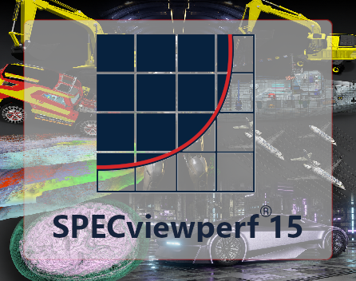
</p>


<!-- omit from toc -->
## Table of Contents
- [Introduction to SPECviewperf](#introduction-to-specviewperf)
- [System Requirements](#system-requirements)
  - [Minimum System Specifications](#minimum-system-specifications)
  - [Supported Architectures](#supported-architectures)
  - [Supported Platform Matrix](#supported-platform-matrix)
    - [x86\_64 (amd64)](#x86_64-amd64)
    - [aarch64 (arm64)](#aarch64-arm64)
  - [Workload Specific Requirements](#workload-specific-requirements)
- [Installation Guide](#installation-guide)
  - [Downloading SPECviewperf](#downloading-specviewperf)
  - [Distribution packages (Linux)](#distribution-packages-linux)
  - [Step-by-Step Installation Instructions](#step-by-step-installation-instructions)
    - [Launching the application](#launching-the-application)
  - [Workloads after installation](#workloads-after-installation)
  - [Offline Install](#offline-install)
    - [Option A: Retain packages from an online install](#option-a-retain-packages-from-an-online-install)
    - [Option B: Manually download workload packages](#option-b-manually-download-workload-packages)
- [Benchmark Usage](#benchmark-usage)
  - [Preparing Your System for Benchmarking](#preparing-your-system-for-benchmarking)
    - [Hybrid graphics setup](#hybrid-graphics-setup)
  - [Main Window](#main-window)
  - [Benchmark Configuration](#benchmark-configuration)
  - [System Configuration Report](#system-configuration-report)
  - [Running the Benchmark](#running-the-benchmark)
  - [Run Status and Completion](#run-status-and-completion)
  - [Manage Results](#manage-results)
    - [Result Packaging and Submission](#result-packaging-and-submission)
  - [Advanced Configuration Options](#advanced-configuration-options)
  - [Command-Line Interface](#command-line-interface)
- [Results and Reporting](#results-and-reporting)
  - [Scoring](#scoring)
  - [Result Output](#result-output)
  - [Comparing Results Across Different Systems](#comparing-results-across-different-systems)
- [Software Updates](#software-updates)
- [Version History](#version-history)
- [Uninstalling SPECviewperf](#uninstalling-specviewperf)
- [Benchmark Compliance](#benchmark-compliance)
  - [Run Rules](#run-rules)
  - [Submission Candidacy](#submission-candidacy)
- [Technical Support](#technical-support)
  - [Known Issues](#known-issues)
  - [Contacting Support](#contacting-support)
  - [FAQs](#faqs)
- [Appendix](#appendix)
  - [Glossary of Terms](#glossary-of-terms)
  - [Reference Documents and Links](#reference-documents-and-links)
- [Acknowledgements and Credits](#acknowledgements-and-credits)
- [Copyright](#copyright)


## Introduction to SPECviewperf
The SPECviewperf® 15 Linux Edition benchmark, developed by the SPEC® Graphics & Workstation Performance Group's ([SPECgwpg](https://gwpg.spec.org/about-gwpg/)) Graphics Performance Characterization (SPECgpc®) subcommittee, is the worldwide standard for measuring graphics performance based on professional applications. The benchmark measures the 3D graphics performance of systems running under the OpenGL application programming interface. The benchmark workloads represent graphics content and behavior from actual workstation-class applications, without installing the applications themselves:

- *blender-01*: derived from Blender 3.6 LTS using OpenGL
- *catia-07*: derived from Dassault Systèmes' CATIA V5 and 3DEXPERIENCE CATIA applications using OpenGL
- *creo-04*: created from PTC's Creo 9™ using OpenGL
- *energy-04*: inspired by OpendTect seismic visualization, uses OpenGL
- *maya-07*: created with Autodesk Maya 2025 using OpenGL
- *medical-04*: exploring datasets from a beating heart, brain, and alligator using the Tuvok library and OpenGL
- *snx-05*: created from Siemens NX 2406 using OpenGL
- *solidworks-08*: derived from Dassault Systèmes' SolidWorks 2024 using OpenGL

For more information, see [benchmark page](https://gwpg.spec.org/benchmarks/benchmark/specviewperf-15-0-1-linux-edition).

The Linux Edition includes the OpenGL-based workloads listed above for both **x86_64** and **aarch64** Linux systems. The Windows Edition workloads *3dsmax-08*, *enscape-01*, and *unreal_engine-01* are not included in the Linux Edition.

## System Requirements

### Minimum System Specifications
The following is the minimum supported system configuration. Some workloads may still run on systems that do not meet these requirements, but support will not be provided by SPEC for any such configuration.

**Official SPEC support** is limited to the configurations described in this section. The benchmark may install and run on other system configurations; however, SPEC does not guarantee correct operation on unsupported configurations and **does not provide technical support** for them.

| Component | Requirement |
| --- | --- |
| CPU architecture | _x86_64_ (amd64) or _aarch64_ (arm64); see [Supported Architectures](#supported-architectures) |
| OS | _x86_64:_ Ubuntu 24.04 LTS, Red Hat Enterprise Linux 10, Rocky Linux 10, or Fedora 43<br>_aarch64:_ Ubuntu 24.04 LTS |
| CPU | _x86_64:_ _Intel 12th Gen_ or _AMD Ryzen 7000 series_ or newer<br>_aarch64:_ 64-bit ARM (_aarch64_) workstation processor |
| Graphics | _AMD_ or _NVIDIA_ GPU with _4GB or greater shared or dedicated memory_ and _OpenGL 4.5_ <a href="#workload-specific-requirements">🔗 See Workload Requirements</a> |
| RAM | _15GB available system RAM_ |
| Disk Space | At least _100GB free space_ for install and execution |
| Display Resolution | Minimum 1920 x 1080 |
| Desktop Environment | _GNOME_ with the _Mutter_ compositor |

Note:
- The OS versions listed above are the configurations for which SPEC provides official support. The benchmark may install and run on other distributions or versions; however, SPEC does not guarantee correct operation on unsupported configurations and **does not provide technical support** for them.
- The benchmark run requirements are the minimum requirements that we guarantee the benchmark will run with. This is not the same as the submission requirements, as you can meet the run requirements without qualifying as a [submission candidate](#submission-candidacy).
- See the [Supported Platform Matrix](#supported-platform-matrix) for supported distribution, display server, desktop environment, and compositor combinations.
- The Linux Edition supports AMD and NVIDIA graphics, including integrated GPUs. Intel graphics are not supported.
- Use a current GPU driver package from your GPU vendor or distribution that provides OpenGL 4.5 support and meets the workload-specific requirements below.

### Supported Architectures

SPECviewperf 15 Linux Edition is available for **x86_64** and **aarch64** systems. Both builds provide the same eight official OpenGL workloads, but they use architecture-specific application and workload binaries.

| Architecture | Common names | Distribution formats |
| --- | --- | --- |
| x86_64 | amd64, x64 | tar.gz archive, RPM, and DEB |
| aarch64 | arm64 | tar.gz archive and DEB only |

Notes:
- **RPM packages are provided for x86_64 only.** aarch64 systems should use the tar.gz archive or DEB package.
- Results from x86_64 and aarch64 systems are not directly comparable; treat each architecture as its own performance class.
- On aarch64, use the aarch64-labelled download even if your distribution reports the architecture as `arm64`.

### Supported Platform Matrix

The following tables list distribution, display server, desktop environment, and compositor combinations for which SPEC provides official support. Red Hat Enterprise Linux 10, Rocky Linux 10, and Fedora 43 **Workstation** editions ship **GNOME** by default; the supported x86_64 configurations below match those defaults.

#### x86_64 (amd64)

| Distribution | Display server | Desktop environment | Compositor | SPEC support |
| --- | --- | --- | --- | --- |
| Ubuntu 24.04 LTS | Wayland | GNOME | Mutter | Supported |
| Ubuntu 24.04 LTS | X11 | GNOME | Mutter | Supported |
| Red Hat Enterprise Linux 10 | Wayland | GNOME | Mutter | Supported |
| Rocky Linux 10 | Wayland | GNOME | Mutter | Supported |
| Fedora 43 | Wayland | GNOME | Mutter | Supported |

#### aarch64 (arm64)

Official aarch64 support is currently limited to Ubuntu 24.04 LTS. RPM-based Enterprise Linux and Fedora distributions are not supported for aarch64 because an RPM package is not provided for that architecture.

| Distribution | Display server | Desktop environment | Compositor | SPEC support |
| --- | --- | --- | --- | --- |
| Ubuntu 24.04 LTS | Wayland | GNOME | Mutter | Supported |
| Ubuntu 24.04 LTS | X11 | GNOME | Mutter | Supported |


<!-- omit from toc -->
#### Calculation of SPECviewperf15 Memory Requirements
In the benchmark, memory is categorized based on its allocation to GPU and CPU, and is defined differently for discrete and integrated GPU setups. Here’s how memory is calculated for each scenario:


| **System Type**          | **VP_GPU_memory**                                           | **VP_CPU_memory**                                                                 |
|-------------------------|------------------------------------------------|------------------------------------------------------------------|
| **Discrete GPU Systems** | Dedicated GPU memory                             | Total physical CPU memory available                              |
| **Integrated GPU Systems** | Dedicated GPU memory + Shared GPU memory       | Total physical CPU memory available minus the larger of: (1) Memory already dedicated to GPU or (2) 4GB (for optimal GPU performance) |
| **General Requirements** | Must be at least **4GB**                         | Must be at least **15GB**                                        |

Note:
- These requirements are as per Full HD resolution.
- When running the workloads in 4K resolution, the application will require more memory. Running on systems with limited resources may lead to timeouts, system hangs, or graphical corruptions.

### Workload Specific Requirements

Some workloads test features that require special hardware and driver support. If your GPU does not meet these requirements, those workloads will be disabled.

| Workload | Requirement(s) |
| --- | --- |
| catia-07 | _at least 6GB video memory_ |
| energy-04 | _at least 4GB video memory_ |


**Note:**
- When running certain workloads, entry-level graphics and older hardware may exhibit a lock-up due to the GPU driver's hang detection and recovery mechanism (similar to Windows Timeout Detection and Recovery, or TDR). If this occurs, increasing the hang detection or recovery timeout may help. Refer to your GPU vendor's Linux driver documentation for the supported method on your hardware and driver package.

## Installation Guide

### Downloading SPECviewperf
The SPECviewperf 15 Linux Edition benchmark can be obtained from the `Download` tab of the [SPECviewperf 15.0.1 Linux Edition benchmark page](https://gwpg.spec.org/benchmarks/benchmark/specviewperf-15-0-1-linux-edition). Complete the form on that tab for a free download or a paid license, as applicable. After you submit the form, you are redirected to a page where the installer and workload packages are hosted. Separate downloads are provided for **x86_64** and **aarch64**; choose the package that matches your system’s CPU architecture and Linux distribution.

Linux builds are distributed as:
- a **tar.gz** archive for both architectures
- an **RPM** package for x86_64 RPM-based distributions
- a **DEB** package for Debian-based distributions on both architectures

Individual workload packages on that redirected page can also be downloaded manually for [offline installation](#offline-install).

It is free to download for everyone except sellers of computers and related products. A paid license is required for any for-profit entity that sells computers or computer related products in the commercial marketplace, with the exception of [SPECgwpg member companies](https://gwpg.spec.org/membership/).

### Distribution packages (Linux)
Exact file names include the product version and CPU architecture. Typical examples:

| Architecture | Format | Example filename |
| --- | --- | --- |
| x86_64 | Archive | `SPECviewperf-15.0.1-LE-linux.tar.gz` |
| x86_64 | RPM | `specviewperf15-15.0.1-LE.x86_64.rpm` |
| x86_64 | DEB | `specviewperf15_15.0.1-LE_amd64.deb` |
| aarch64 | Archive | `SPECviewperf-15.0.1-LE-aarch64-linux.tar.gz` |
| aarch64 | DEB | `specviewperf15_15.0.1-LE-aarch64_arm64.deb` |

Choose one format for your architecture. The archive is suitable when you want to extract the benchmark to a directory you choose without using the system package manager. The RPM and DEB packages install the application through your distribution’s tooling and record dependencies where applicable. An RPM package is not provided for aarch64.

### Step-by-Step Installation Instructions

The examples below use the 15.0.1-LE release filenames; substitute the actual filenames from your download.

**Tar.gz archive (x86_64 or aarch64)**

1. Extract the archive to the location where you want the benchmark installed:

x86_64:
```bash
tar xzf SPECviewperf-15.0.1-LE-linux.tar.gz
```

aarch64:
```bash
tar xzf SPECviewperf-15.0.1-LE-aarch64-linux.tar.gz
```

**RPM package (x86_64 only)**

Install with your distribution’s package manager so required dependencies are resolved automatically. Example (use the actual `.rpm` filename):

```bash
sudo dnf install ./specviewperf15-15.0.1-LE.x86_64.rpm
```

On Red Hat Enterprise Linux 10, Rocky Linux 10, and similar Enterprise Linux distributions, some runtime dependencies may be provided by optional repositories rather than the base OS repositories. If `dnf` reports `nothing provides` errors while installing the RPM, enable the distribution’s CodeReady Builder/CRB repository and EPEL repository, then retry the install. For example, on Rocky Linux:

```bash
sudo dnf config-manager --set-enabled crb
sudo dnf install epel-release
sudo dnf install ./specviewperf15-15.0.1-LE.x86_64.rpm
```

On Red Hat Enterprise Linux, enable the equivalent CodeReady Builder repository using Red Hat’s documented subscription-management process, and enable EPEL only if permitted by your organization’s software policy.

**DEB package (x86_64 or aarch64)**

Install with `apt` or your preferred frontend (use the actual `.deb` filename):

x86_64:
```bash
sudo apt install ./specviewperf15_15.0.1-LE_amd64.deb
```

aarch64:
```bash
sudo apt install ./specviewperf15_15.0.1-LE-aarch64_arm64.deb
```

#### Launching the application

| Install format | GUI | Command-line interface |
| --- | --- | --- |
| RPM or DEB | Open **SPECviewperf15** from the GNOME application menu (Activities search) | Run `specviewperf15-cli` from any terminal; the package installs this command system-wide |
| Tar.gz archive | Run `./SPECviewperf` from the extracted directory | Run `./SPECviewperf-CLI` from the extracted directory |


### Workloads after installation

After the benchmark application is installed, open it and complete workload download and installation when prompted (the First Run Experience / Install Workloads window). By default, all official SPECviewperf 15 Linux Edition workloads are selected; you may install a subset. At least one workload must be installed to run the benchmark. On Linux, the default download directory is `$HOME/Downloads`.

<p align="center">
    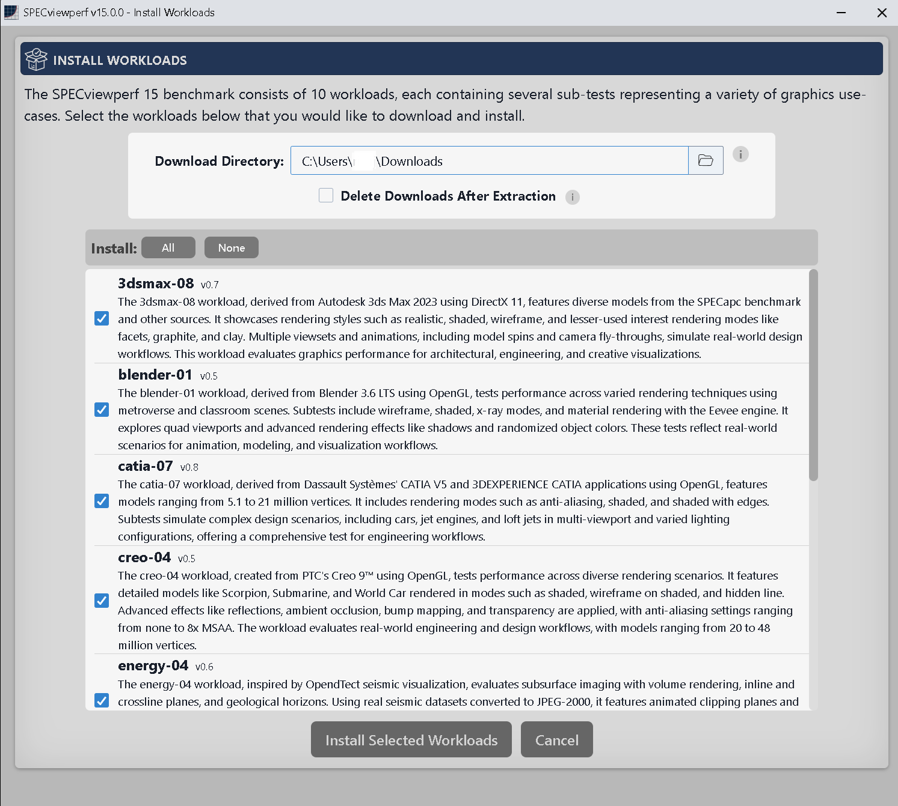
    <br>
    <em>First Run Experience (Install Workloads) window</em>
</p>

By default, **Delete Downloads After Extraction** is enabled, so downloaded workload packages are removed after install. Uncheck it if you want to keep the packages (for example, for an [offline install](#offline-install)).

### Offline Install

Use these steps when target systems have no (or limited) internet access for downloading workload packages.

**Where packages must be placed:** On Linux Edition, place local workload packages in the user’s Downloads directory (`$HOME/Downloads`). Packages elsewhere are not detected unless you change **Download Directory** in the UI.

**Delete Downloads After Extraction:** Uncheck this option so retained downloads are kept in the Downloads directory. It appears in:

- the First Run Experience (Install Workloads) window, and
- **Advanced Settings** at the bottom of the [Benchmark Configuration](#benchmark-configuration) window

You can obtain workload packages in either of the following ways.

#### Option A: Retain packages from an online install

1. On a system with internet access, install SPECviewperf 15 Linux Edition for the same CPU architecture (**x86_64** or **aarch64**) and distribution format (tar.gz, RPM, or DEB) you will use offline.
2. Launch the application. In the First Run Experience window, **uncheck** **Delete Downloads After Extraction** (or set it in **Advanced Settings** if first-run setup is already done).
3. Select every workload you want available offline, then click **Install Selected Workloads**.
4. Copy the retained package files from `$HOME/Downloads` to removable media or another transfer location.
5. On each offline system:
   1. Install the same SPECviewperf 15 Linux Edition build.
   2. Copy the workload package files into that user’s `$HOME/Downloads` directory.
   3. Launch the application and install the workloads when prompted. Local packages are used instead of downloading.

#### Option B: Manually download workload packages

1. From a system with internet access, obtain the installer and each workload package you need as described in [Downloading SPECviewperf](#downloading-specviewperf). Some workloads are split across multiple files; download every part listed for those workloads.
2. On each offline system, install the application, copy all workload package files into `$HOME/Downloads`, then launch the application and install the selected workloads from the local packages.

**Notes:**
- aarch64 workload packages are not interchangeable with x86_64 packages.
- Workload packages are large; allow enough free disk space in `$HOME/Downloads` and on the transfer media.

## Benchmark Usage

### Preparing Your System for Benchmarking

Refer to the [run rules](#run-rules) for benchmark compliance prior to running SPECviewperf.

Before running, consider the following Linux-specific preparation steps:
- For configurations supported by SPEC, use a **GNOME (Mutter)** desktop session (see the [Supported Platform Matrix](#supported-platform-matrix)).
- Install the latest supported GPU driver from your GPU vendor or distribution.
- Set the CPU governor or system power profile to a performance-oriented mode where applicable.
- On hybrid systems with integrated and discrete GPUs, configure the system to use the GPU you intend to test (see [Hybrid graphics setup](#hybrid-graphics-setup) below).
- Disable or exclude on-access antivirus or endpoint protection for the benchmark install and results directories if it interferes with benchmark performance.
- Configure your desktop environment so panels, docks, and other UI elements do not overlap the benchmark viewport during a run.
- On multi-monitor systems, confirm that your primary display meets the selected benchmark resolution.

#### Hybrid graphics setup

On hybrid systems, the desktop session often uses the integrated (onboard) GPU by default, and the benchmark may launch on that GPU as well. Runs on either an integrated or discrete GPU are valid, provided the GPU meets the [system requirements](#minimum-system-specifications).

**NVIDIA hybrid systems**

On **X11**, when PRIME is set to **NVIDIA on-demand**, this is expected behavior. To use the discrete NVIDIA GPU, select **NVIDIA (Performance Mode)** in **NVIDIA X Server Settings** → **PRIME Profiles**. If you need to stay in on-demand mode, use the **Finer-Grained Control of OpenGL** section in the NVIDIA PRIME render offload documentation.

On **Wayland**, the compositor controls which GPU drives the desktop session; PRIME Profiles in `nvidia-settings` may not be available or may not apply. The same **Finer-Grained Control** sections apply for selecting the discrete GPU when running applications.

Refer to the NVIDIA PRIME render offload documentation installed with your driver:

```bash
xdg-open /usr/share/doc/NVIDIA_GLX-1.0/html/primerenderoffload.html
```

**AMD hybrid systems**

Refer to the [Mesa `DRI_PRIME` documentation](https://docs.mesa3d.org/envvars.html#envvar-DRI_PRIME) and the [AMDGPU Linux kernel driver documentation](https://docs.kernel.org/gpu/amdgpu/index.html) for guidance on selecting the GPU on hybrid AMD systems.

### Main Window
The main GUI interface allows the user to configure and run the benchmark.
- The `Enabled Workloads` field shows how many workloads have been selected to run out of the total number of workloads available.
The value will be shown in red font if the run will not be considered a [submission candidate](#submission-candidacy) or errors are detected with any workload.
Opening the [benchmark configuration](#benchmark-configuration) window may provide additional details on workload errors.
- Workload selection can be changed via the benchmark configuration menu opened with the gear icon next to `Run Benchmark` button.

  <p align="center">
      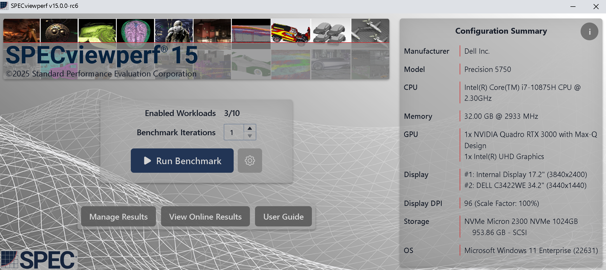
      <br>
      <em>SPECviewperf graphical user interface (GUI)</em>
  </p>

  <p align="center">
      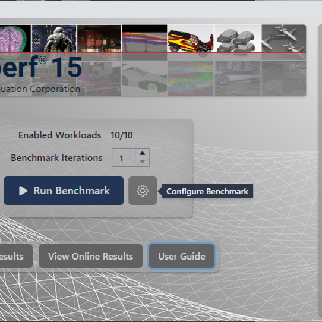
      <br>
      <em>SPECviewperf GUI Configure Benchmark Button</em>
  </p>

### Benchmark Configuration
The benchmark configuration window allows users to select which workloads to run. The benchmark configuration window will also present options to install/uninstall a workload, or update a workload if a new version is available.

The user can also choose the resolution they want to run the workloads at via the radio buttons on the top of the window. The default is `4K` (3840x2160) if the display supports it, else it falls back to `Full HD` (1920x1080).

<p align="center">
    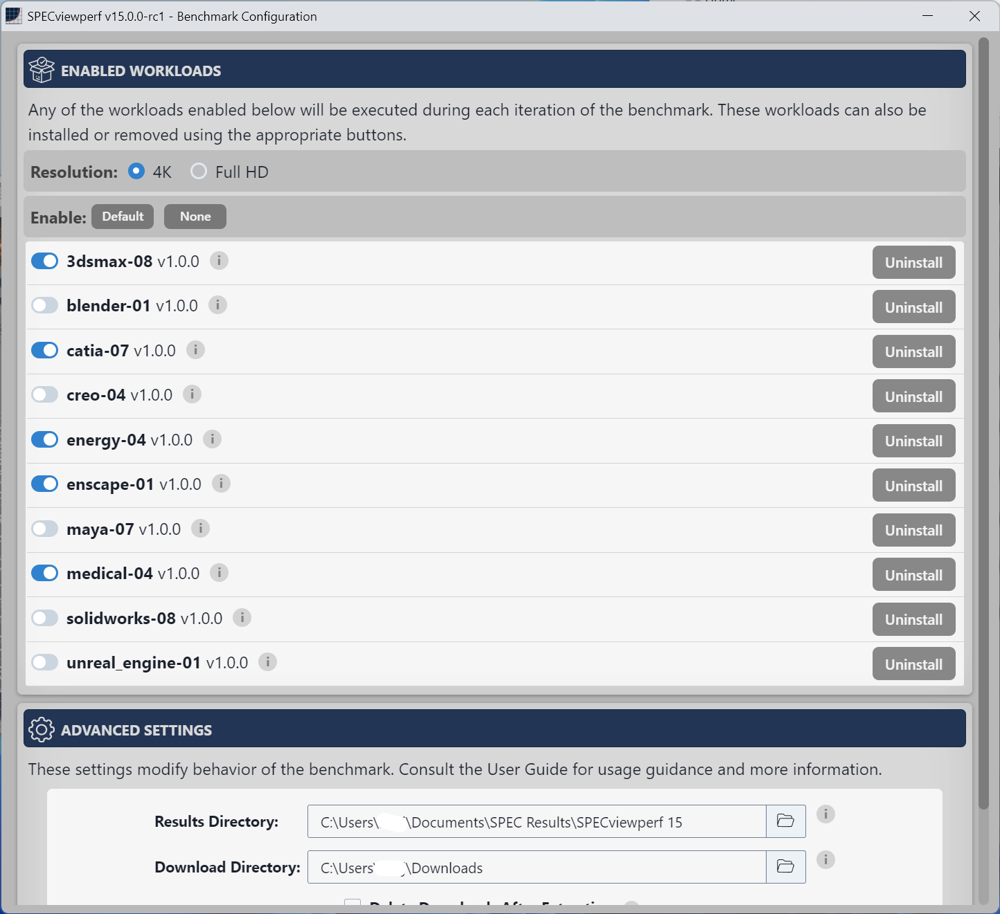
    <br>
    <em>Benchmark configuration window for workload selection</em>
</p>

### System Configuration Report
System configuration details collected by the benchmark can be viewed by clicking the info icon in the top right of the [main window](#main-window).

<p align="center">
    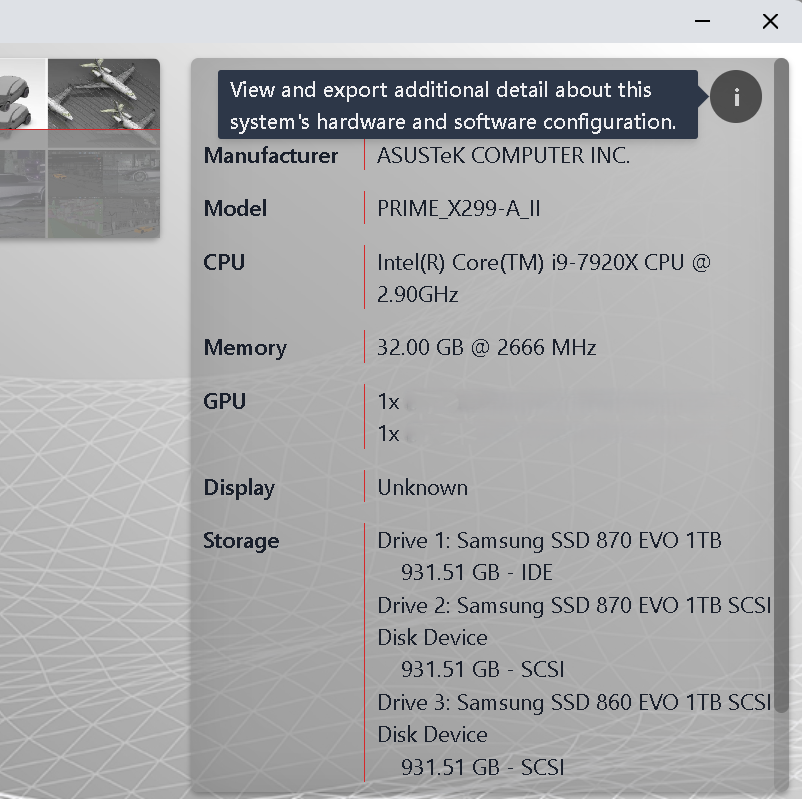
    <br>
    <em>Info icon to open system configuration window</em>
</p>

Options are provided to export details in various formats.  Note that the detected configuration details are embedded into all result files.  System details do not contain user-identifiable information and users can verify no personal details are exposed by inspecting the information in this screen. The `Exporting Debug Data` option may generate output containing identifiable information, but is typically only needed for debugging and support requests.

<p align="center">
    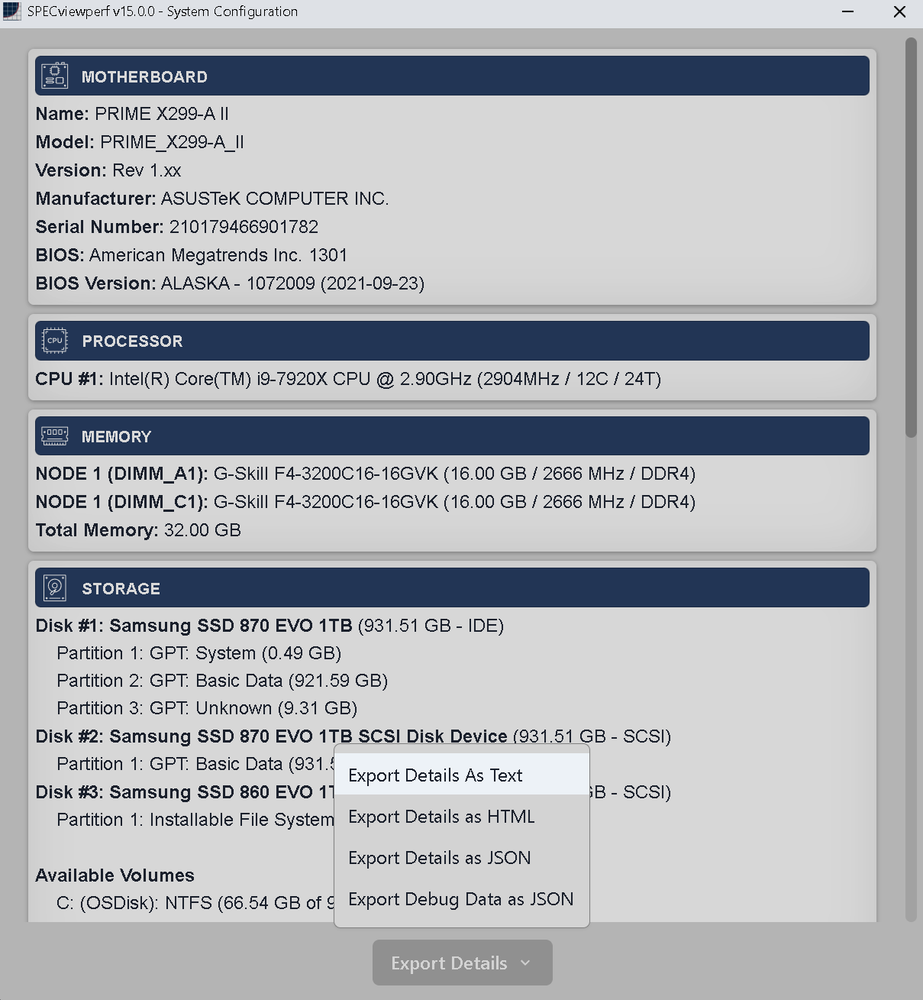
    <br>
    <em>System configuration Details</em>
</p>

### Running the Benchmark

Selecting `Run Benchmark` from the main window will display a confirmation window listing the benchmark configuration including workloads, resolution and iterations for the run.
The confirmation window will also state if the run can generate a [result for submission](#submission-candidacy) to SPEC to publish on the official [SPECviewperf results](https://gwpg.spec.org/SPECviewperf-results/) page.

<p align="center">
    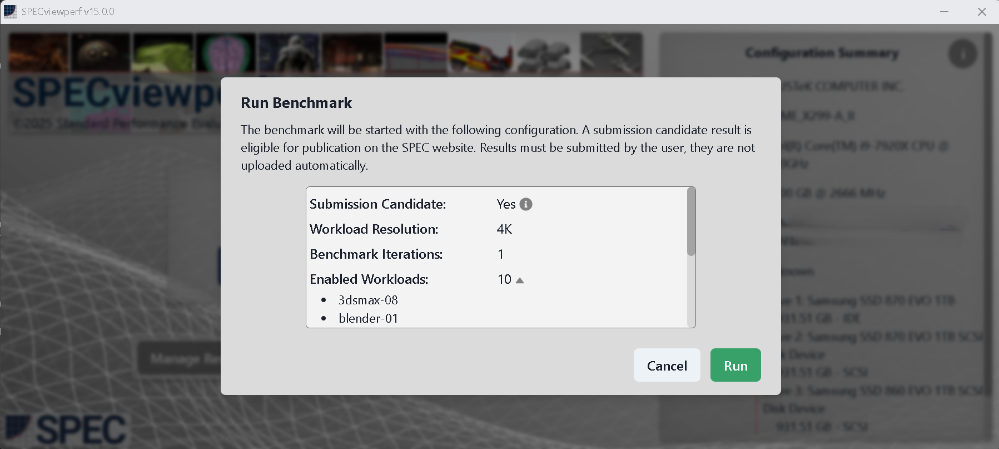
    <br>
    <em>Run benchmark confirmation window</em>
</p>

Note: the benchmark does not automatically send or upload any information to SPEC. Results or system configuration details are not uploaded or collected automatically -- they must be properly [packaged](#result-packaging-and-submission) and sent to SPEC by the user.

### Run Status and Completion

During a run, the benchmark status window will show which workload and subtest is currently executing and the overall progress of the benchmark run.
If a user wishes to stop the benchmark during a run, it can be done from this window. Upon pressing the `Stop` button, the GUI will then pop up a confirmation window to stop or resume the benchmark execution.

<p align="center">
    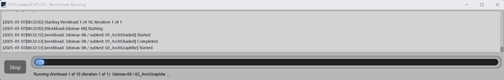
    <br>
    <em>Benchmark status window</em>
</p>

After a run completes, the user is given the option to open the results manager.

<p align="center">
    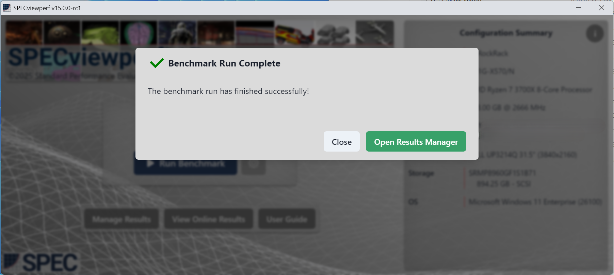
    <br>
    <em>Run complete window</em>
</p>

### Manage Results

The `Manage Results` button in the [main window](#main-window) or the `Open Results Manager` button in the [run completion window](#run-status-and-completion) opens the results manager. Clicking a result will open the HTML result file.

<p align="center">
    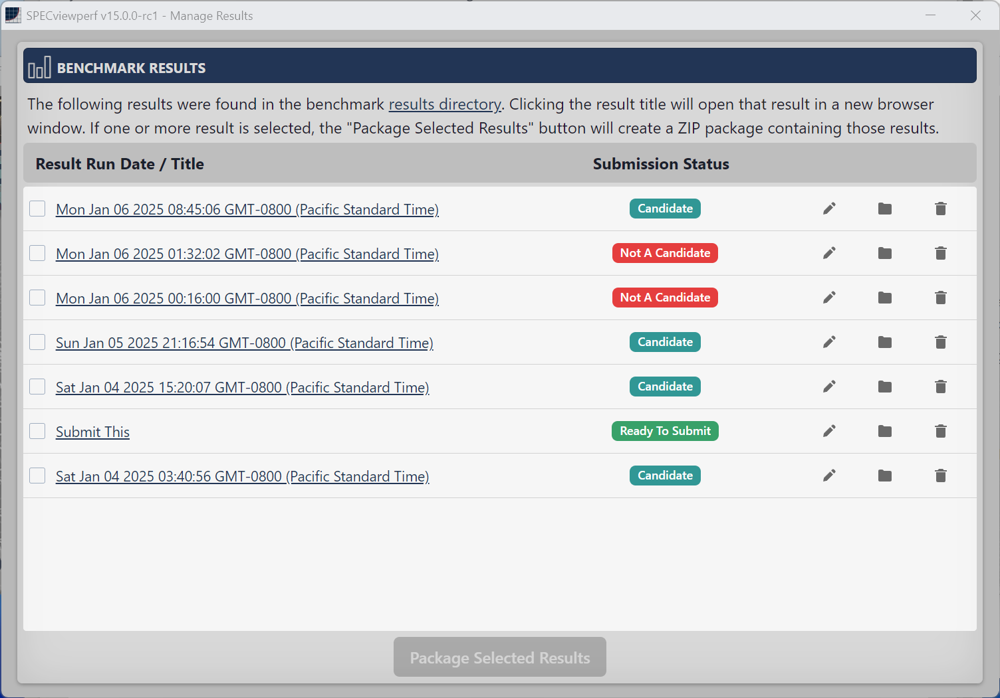
    <br>
    <em>Manage results window</em>
</p>

The `results directory` link at the top of the results manager will open the currently set result folder. The default result folder is `$HOME/Documents/SPEC Results/SPECviewperf 15`, but can be changed from the [advanced settings menu](#advanced-configuration-options). Note that results may be marked `Candidate` or `Not A Candidate`. If the submission status is `Candidate`, the results may be [packaged and submitted](#result-packaging-and-submission) to SPEC for review and publication. If submission details are complete, the submission status will show `Ready To Submit`.

A result's directory may be accessed by clicking the folder icon next to a result. The result directory includes results in HTML, CSV, and JSON formats, along with logs, screen grabs, and other meta-data from each selected workload from the run.  If a result is expected to be submitted to SPEC for publication, all files in the result directory should remain unaltered.

Results may be annotated with a title and other submission information.  Clicking the pencil icon in the result row will open the results / submission details window.

<p align="center">
    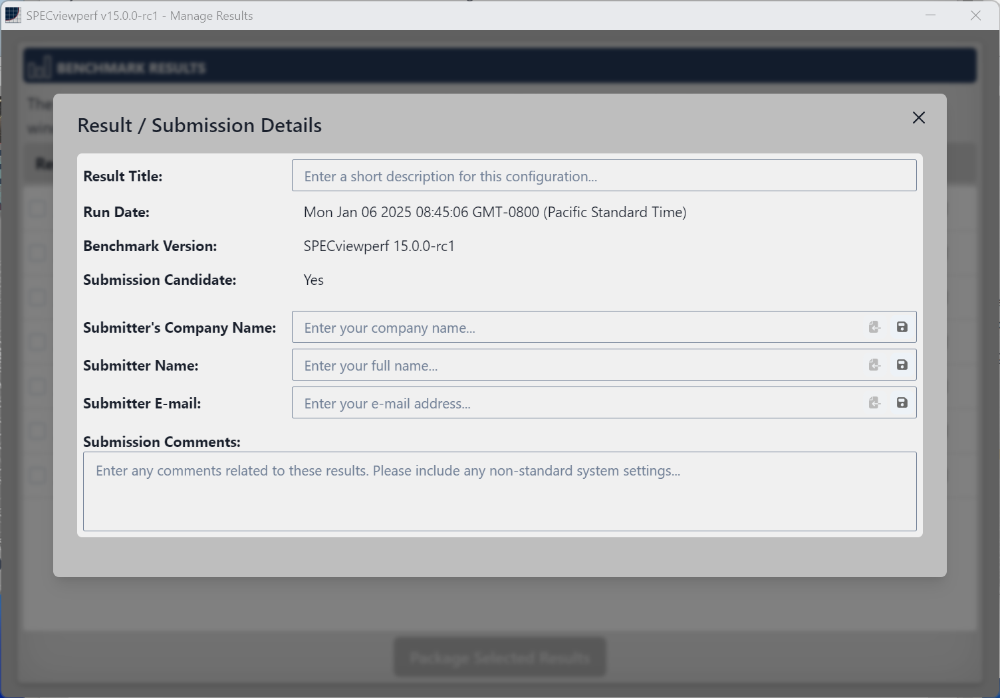
    <br>
    <em>Results / Submission details window</em>
</p>

Adding submission details is required only if submitting a result to SPEC. Users may also use this functionality to rename results and keep notes for their own tracking purposes.

#### Result Packaging and Submission

The [Manage Results](#manage-results) window allows users to display results from all the benchmark runs for packaging and/or submission.  Selecting one or more results with the checkbox will enable the `Package Selected Results` button, which generates a zip file containing the selected results. The result package will be created in the same folder as the results (default folder: `$HOME/Documents/SPEC Results/SPECviewperf 15`).

<p align="center">
    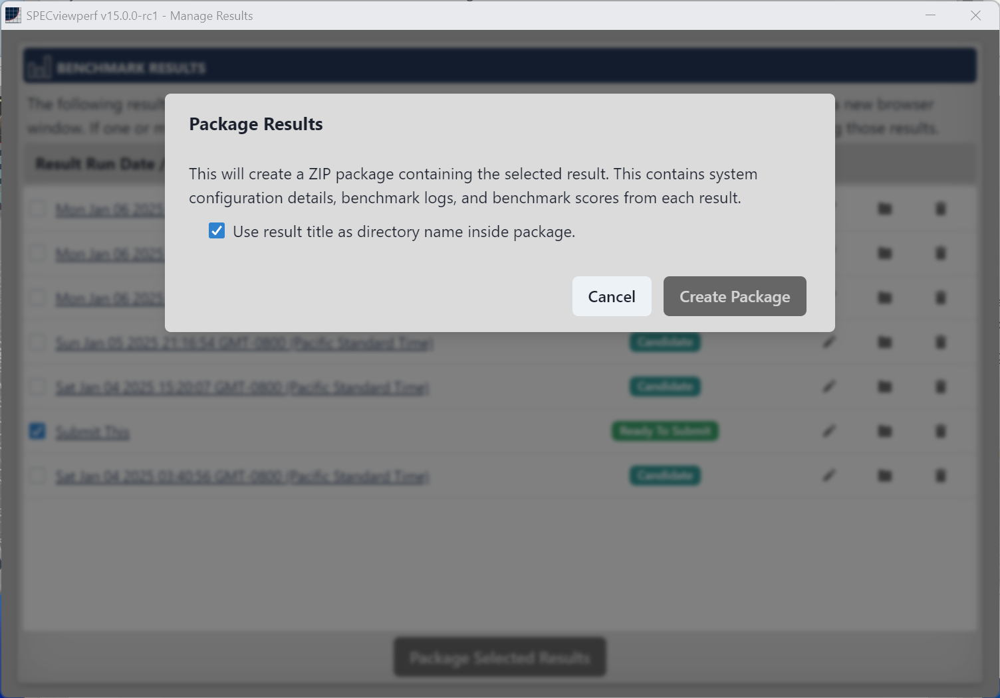
    <br>
    <em>Select results to package from the result manager window</em>
</p>

A user may package results for their own convenience or, if a result is marked as a `Candidate`, for submission to SPEC.
- Submissions to SPEC must include complete submission details for every packaged result.
- Submission comments must include any performance-relevant system customization details that are not captured in the [system configuration](#system-configuration-report) window and may include any additional information helpful to the reviewer. Examples of additional information to include in the comments:
  1. Links to GPU/accelerator driver download web pages
  2. Any modified BIOS settings, e.g. disabling SMT or hyper-threading, overclocking, RAM speed/timings, etc.
  3. CPU governor or power profile selection (for example, `performance` vs `powersave`) and any changes to default profiles
  4. Disabling VSYNC or compositor-level vsync settings
  5. Status of antivirus, endpoint protection, or on-access scanning and any exclusions configured for the benchmark
  6. Links to system specification or purchase web pages

Before submitting, review the complete [submission candidate](#submission-candidacy) criteria.

### Advanced Configuration Options
The advanced settings menu is located at the bottom of the [Benchmark Configuration](#benchmark-configuration) window. Each option is described in the table below.

<p align="center">
    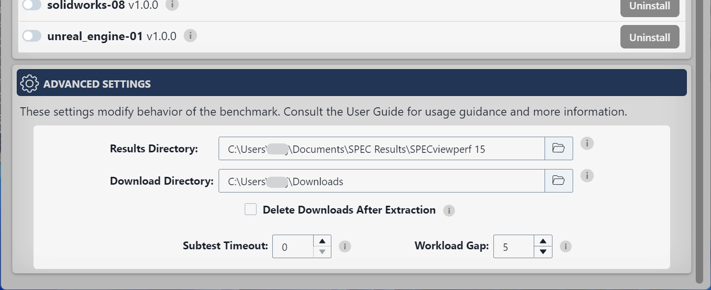
    <br>
    <em>Advanced settings menu</em>
</p>

| Option | Description |
| --- | --- |
| Results Directory | Change the default results directory where results are saved.  The result manager window will only show results from the directory listed in this field. If changed, the result directory can be reset to default by clicking the reset icon next to the input field. |
| Download Directory | Directory where workload installation packages are downloaded and saved (default: `$HOME/Downloads`). |
| Delete Downloads After Extraction | If checked, deletes workload packages after successful installation. Uncheck to keep them; see [Offline Install](#offline-install). |
| Subtest Timeout | If set to a non-zero value, tests will terminate after that defined timeout in minutes and proceed to the next test. Disable this if your system is encountering frequent timeouts and you believe the workload is still running correctly by setting to 0 (default.) |
| Workload Gap | Add a waiting period between each workload execution. May be used to allow systems to thermally recover between workloads. |

### Command-Line Interface

The command-line interface (CLI) enables easy automation and integration into scripts. The CLI is invoked with the `specviewperf15-cli` binary found in the install folder (default `/opt/SPEC/SPECviewperf15`). Run the CLI without any options or with the help command, `specviewperf15-cli --help`, to display all available options.

<p align="center">
    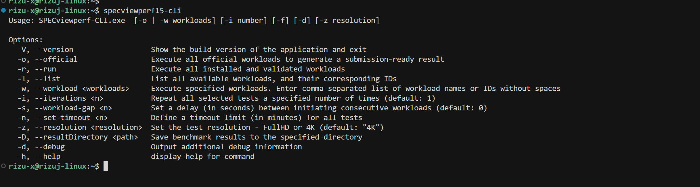
    <br>
    <em>Command-line interface</em>
</p>

Some common CLI options are shown in the following table:

| CLI Option | Description |
| --- | --- |
| `--version` / `-V` | Show the application build version and exit |
| `--official` / `-o` | Run all official workloads |
| `--run` / `-r` | Run all installed workloads |
| `--list` / `-l` | List available workloads and subtests |
| `--workload` / `-w` `[workload-list]` | Run selected workloads (comma-separated names or IDs, no spaces) |
| `--iterations` / `-i` `<n>` | Repeat the selected tests `n` times (default: 1) |
| `--workload-gap` / `-s` `<n>` | Delay in seconds between consecutive workloads (default: 0) |
| `--set-timeout` / `-n` `<n>` | Subtest timeout in minutes; `0` disables the timeout |
| `--resolution` / `-z` `[resolution]` | Run workloads at Full HD or 4K resolution (default: 4K if the display supports it) |
| `--resultDirectory` / `-D` `<path>` | Save results to the specified directory |
| `--debug` / `-d` | Output additional debug information |
| `--help` / `-h` | Display all options and parameters |

During a CLI run, the benchmark will accept the following commands to stop or skip workloads:

| Command | Description |
| --- | --- |
| `Ctrl+C` | Cancel benchmark run, attempt to save partial results |
| `x` | Abort and skip the currently running workload |

**Example Usage:**

*1. Running Specific Workloads*: To run selected workloads such as blender-01 and catia-07, use the following command:

  `$ specviewperf15-cli -w blender-01,catia-07`

  *Output:*

    [2025-01-08|09:21:17] Gathering System Details: Started
    [...]
    [2025-01-08|09:21:32] Workload initialization: Finished

    Valid Workloads:
      1) blender-01 [v1.0.0]
        ✓ 01_MetroverseWireframeQuad
        [...]
      2) catia-07 [v1.0.0]
        ✓ 01_FourICDCarsWhite
        [...]

    [2025-01-08|09:21:32] Starting Workload 1 of 2, Iteration 1 of 1
    [2025-01-08|09:21:32] [Workload:blender-01] Starting
    [...]

  *Notes:*
   - Replace blender-01,catia-07 with the desired workload names or IDs.
   - Use --list (-l) to view all available workloads before running the command.

  `$ specviewperf15-cli -w 2,4 -z FullHD`

  *Output:*

    [2025-01-08|09:46:48] Gathering System Details: Started
    [...]
    [2025-01-08|09:46:56] Workload initialization: Finished

    Valid Workloads:
      2) blender-01 [v1.0.0]
        ✓ 01_MetroverseWireframeQuad
        [...]
        ✓ 07_ClassroomEevee

      4) creo-04 [v1.0.0]
        ✓ 01_ScorpionShadedReflections
        [...]
        ✓ 13_ScorpionNoHidden

    [2025-01-08|09:46:56] Starting Workload 1 of 2, Iteration 1 of 1
    [2025-01-08|09:46:56] [Workload:blender-01] Starting
    [2025-01-08|09:46:56] [workload: blender-01 / subtest: 01_MetroverseWireframeQuad] Started
    [...]

*2. Running at a specific resolution:*

  `$ specviewperf15-cli -w maya-07` // Not adding --resolution param will default to 4K resolution, if supported by the system.

  `$ specviewperf15-cli -w maya-07 --resolution FullHD` // Will run at FullHD resolution, if supported by the system.

*3. Debug Logs:*

  `$ specviewperf15-cli -w maya-07 --resolution FullHD --debug`

  *Output:*

    {
      iterations: 1,
      workloadGap: 0,
      resolution: 'FullHD',
      path: 'viewsets/',
      workload: [ 'maya-07' ],
      debug: true
    }
    [2025-01-08|09:35:51] Gathering System Details: Started
    [2025-01-08|09:35:56] Gathering System Details: Finished
    [...]

## Results and Reporting

### Scoring
The benchmark reports two types of scores:
- *Subtest scores* are in "Frames per Second".
- *Workload composite scores* are calculated by taking a weighted geometric mean of the constituent subtest scores (individual subtest weights are available in the CSV result output.)

### Result Output
Each benchmark run and iteration produces a result folder with scores reported in HTML, CSV, and JSON formats.

The **HTML result summary page** shows select [system configuration](#system-configuration-report) information, [benchmark configuration](#benchmark-configuration) information, [submission details](#manage-results) (if entered by the user), and all calculated workload composite scores. If any subtest of a workload did not produce a score, it was likely because it encountered errors, the composite score will be omitted from the results.

<p align="center">
    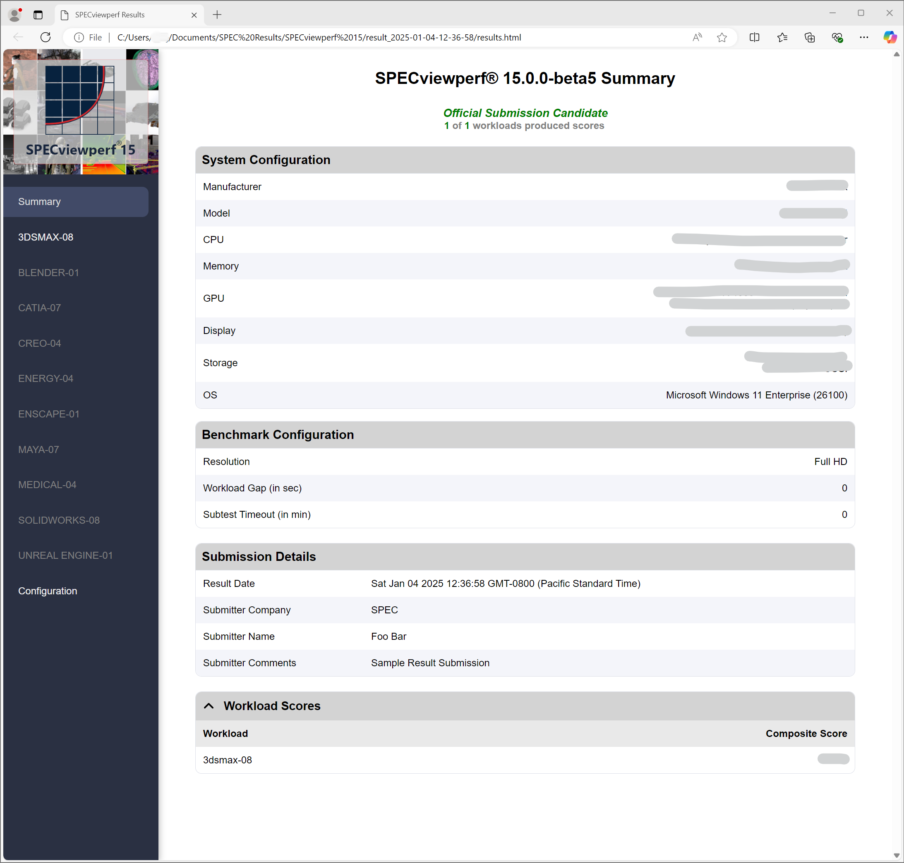
    <br>
    <em>HTML results summary page</em>
</p>

Users may view more details for a workload by selecting its page in the left navigation bar. Individual workload pages list all contributing subtests. The `Workload Scores` page shows the full data for every workload and subtest that completed successfully.

<p align="center">
    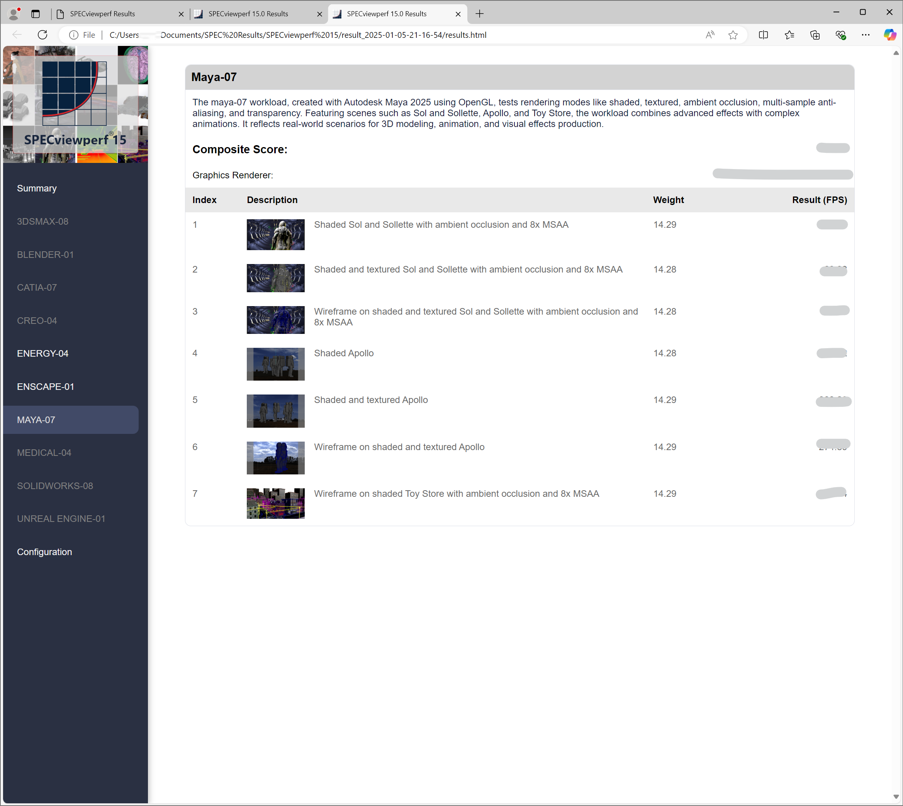
    <br>
    <em>HTML results workload page</em>
</p>

### Comparing Results Across Different Systems

Users may compare their system performance to results posted by SPEC on the official [SPECviewperf Results](https://gwpg.spec.org/SPECviewperf-results/) page.

Note: 4K and Full HD runs of any workload cannot be compared directly. Official results are presented in separate tables for each resolution.

## Software Updates

- An update check is performed at benchmark startup; if an update is available, a tooltip will be shown at the top of the [main window](#main-window).
- The [benchmark configuration](#benchmark-configuration) window will facilitate upgrading a workload if a new version is available.

An internet connection is required for any updates.

## Version History

This section documents the release history for the Linux Edition and the underlying SPECviewperf 15 benchmark versions.

| Version | Release Date | Updates | Notes |
|---------|--------------|---------|-------|
| 15.0.1-LE | Sep 22, 2026 | • Initial release of SPECviewperf 15 Linux Edition with 8 official OpenGL workloads: blender-01, catia-07, creo-04, energy-04, maya-07, medical-04, snx-05, solidworks-08<br>• x86_64 builds distributed as tar.gz, RPM, and DEB packages for supported Linux distributions<br>• aarch64 builds distributed as tar.gz and DEB packages for Ubuntu 24.04 LTS | Initial Linux Edition release |
| 15.0.1  | Dec 11, 2025 | • Adds new workload: snx-05<br>• Minor bug fixes | • Results from version 15.0.1 are still comparable to version 15.0.0. Previous workloads have not been modified.<br>• Users running the full benchmark suite should update to this version to include the new workload in their results. |
| 15.0.0  | May 1, 2025  | • Official release of SPECviewperf 15.0.0 with 10 workloads: 3dsmax-08, blender-01, catia-07, creo-04, energy-04, enscape-01, maya-07, medical-04, solidworks-08, unreal_engine-01<br>• Enhanced usability with a redesigned graphical user interface (GUI) and streamlined installation and configuration processes | Initial Windows Edition release |

## Uninstalling SPECviewperf

- Individual workloads may be uninstalled from the [benchmark configuration](#benchmark-configuration) window.
- To remove the benchmark application itself:
  - **RPM package (x86_64):** `sudo dnf remove specviewperf15` (or `sudo rpm -e specviewperf15-15.0.1-LE.x86_64` using the installed package name)
  - **DEB package (x86_64 or aarch64):** `sudo apt remove specviewperf15`
  - **tar.gz archive:** delete the directory where you extracted the benchmark
- Result folders will not be erased when uninstalling, but can be safely deleted manually (default location for results is `$HOME/Documents/SPEC Results/SPECviewperf 15`).

## Benchmark Compliance

### Run Rules
1. The system under test must meet all [minimum requirements](#minimum-system-specifications) as listed in the SPECviewperf user guide
2. The system under test must perform all the respective graphics API’s functionality and other work requested by the benchmark.
3. The system must be conformant for the pixel format or visual used by OpenGL.
4. Settings for environment variables and driver hints must not disable compliant behavior.
5. No interaction is allowed with the system under test during the benchmark, unless required by the benchmark.
6. The system under test cannot skip frames during the benchmark run.
7. It is not permissible to change the system configuration during the running of a given benchmark. For example, one cannot power off the system, make some changes, then power back on and run the rest of the benchmark.
8. The system should have at least 15 GB of physical memory.
9. Screen grabs for SPECviewperf will be full window size.
10. The color depth used must be at least 24 bits (true color), with at least 8 bits of red, 8 bits of green and 8 bits of blue.
11. If a depth buffer is requested, it must have at least 24 bits of resolution.
12. The display resolution of the main display must match or exceed the selected resolution in the SPECviewperf UI (i.e. 1920x1080 for Full HD or 3840x2160 for 4K.)
13. The display resolution of the main display must be large enough to run the individual tests at their requested window size, with no reduction or clipping of test window contents.
14. Display scaling must be set to 100% (scale factor 1.0) and the entire viewport of a subtest must remain fully visible on-screen for each workload. Results which show viewport warnings in workload log files are unacceptable for publication.
15. No UI or window elements, including but not limited to panels, docks, taskbars, toolbars, menubars, and titlebars, may obstruct the viewport rendering context, except for the SPECviewperf progress GUI. These elements must be configured to auto-hide or be resized so that all test window contents are fully visible on-screen without being clipped or obscured.
16. Tests may be run with or without a desktop/window manager but must be run on some native windowing system.
17. Results to be made public must be generated by the official benchmark which may not be changed, except to correct errors in reporting by the benchmark, and these changes shall be disclosed voluntarily upon submission.
18. Virtualized configurations, defined as any operating system configuration running on a hypervisor or virtualization layer of any kind, must include the word “virtualized” in the submission comments for the result. This information must be populated before packaging and submitting the result so that published results reflect this attribute.
19. Virtualized configurations as defined above must also include a declaration of the transport layer name and version used by the virtualization software in parenthesis after the graphics accelerator listed in the Graphics Accelerator field of the Graphics Hardware Configuration section of the result file.
20. Virtualized configurations as defined above must also include a declaration of the hypervisor name and version used by the virtualization software in parenthesis after the model listed in the Model field of the System Hardware Configuration section of the result file.
21. All configurations shall include a link (URL) to a publicly accessible device driver package used to generate the submission.

### Submission Candidacy
A submission candidate is a result that may be submitted to SPEC for publication on the official [SPECviewperf results](https://gwpg.spec.org/SPECviewperf-results/) page. The following are the criteria for a submission candidate to be published by SPEC:
1. The user follows the [run rules](#run-rules) when collecting results.
2. The machine model and configuration is available for purchase by the general public at the time of submission.
3. *At least one* official workload completes without errors or warnings.
4. In a multi-GPU configuration, all enabled workloads must utilize the same graphics renderer.
5. The result is [packaged with complete submission details](#result-packaging-and-submission).

The results manager of the benchmark will automatically mark a result as a submission candidate if all workloads completed successfully, but it cannot validate all the above criteria. If submitted to SPEC, a result will be reviewed for conformance to the submission criteria.

Any unmet criteria will disqualify the result from being a submission candidate.

Information on where to submit results and the associated costs are detailed on the [SPECgwpg membership page](https://gwpg.spec.org/membership/).

## Technical Support

### Known Issues

Review the known issues and workarounds if you are encountering problems in running the benchmark or are generating unexpected results.

**General Issues**

1. If any crashes or incorrect rendering are encountered, it is recommended to update to the latest GPU-vendor-provided graphics driver.
2. Systems may experience thermal saturation during a benchmark run, increasing variability and reducing performance. Improve system cooling or thermals, or workaround thermal limits by increasing the workload gap in [Advanced Settings](#advanced-configuration-options).
3. Results folder may contain `queryLog` folders that were not deleted automatically.  These may be deleted safely if not being used for debugging a benchmark initialization failure.
4. Calculated [Composite Score](#scoring) values may differ slightly between the JSON and the CSV/HTML result files due to differences in precision and rounding. Official scores should be reported from the CSV or HTML result files.
5. Some machine configurations (typically machines with specifications below the [system requirements](#minimum-system-specifications)) may timeout while running workloads.  Timeouts are disabled by default and can be set in the [Advanced Settings](#advanced-configuration-options) menu or via a [CLI option](#command-line-interface). Results may still be considered [submission candidates](#submission-candidacy) if timeouts are disabled.

**Common Installation and Configuration Issues**

- File corruption can result in verification failures which can fail installation of a workload.
- Modification of workloads after installation can result in workload being disabled from benchmark run.

**Workload Issues**
- *catia-07*
  - The wings in Subtest 04_ThreeLoftJetsWhite look corrupted. This is not a bug in the test, but an artifact in the model source.
  - In 3DEXPERIENCE, the SSAO algorithm does not handle buffer rescaling, which has led to some issues with offscreen 4K rendering appearing in 2K traces. In those tests, the frames were post-processed to correct this.
  - In 3DEXPERIENCE tests, some minor run-to-run variance may occur resulting in non-deterministic screen captures.
- *creo-04*
  - Subtest 07_WorldCarShadedEdges may show flickering effect coming from z-fighting at the bottom of the car.
- *maya-07*
  - Subtests 04_ApolloShaded, 05_ApolloShadedTextured, and 06_ApolloWireframeShadedTextured utilize 8x MSAA, although this antialiasing setting is not documented in the workload description.
  - Subtest 07_ToyStoreWireframeShaded has a z-bleeding visual artifact (seen in textures of the building) that causes a flickering effect. The source of the issue is in the model being used and this is how Maya application renders it.
- *medical-04*
  - The 'BeatingHeart' tests may produce non-deterministic screen grabs.


### Contacting Support

Reach out to us via the [SPECgwpg support page](https://gwpg.spec.org/support/).

### FAQs

**What is SPECviewperf?**

_The SPECviewperf benchmark is a performance evaluation tool created to test professional workstation use cases. Refer to the [Benchmark Introduction](#introduction-to-specviewperf) section for more information._

---

**Who develops SPECviewperf?**

_The SPECviewperf benchmark is developed by the [SPEC](https://www.spec.org/) Graphics & Workstation Performance Group ([SPECgwpg](https://gwpg.spec.org/)), specifically its SPEC Graphics Performance Characterization (SPECgpc) subcommittee._

---
**How many workloads and tests are included?**

_SPECviewperf 15.0.1 Linux Edition is released with 8 official workloads with a total of 65 subtests. Inspect an [official result](https://gwpg.spec.org/SPECviewperf-results/) for a full list of tests in the benchmark._

---

**How do I download the benchmark?**

_Go to the `Download` tab of the [SPECviewperf 15.0.1 Linux Edition benchmark page](https://gwpg.spec.org/benchmarks/benchmark/specviewperf-15-0-1-linux-edition), complete the form for a free download or a paid license, then follow the redirect to the page that lists the packages. It is provided free for everyone except sellers of computers and related products._

---

**How do I create an offline installation package?**

_Refer to [Offline Install](#offline-install) for instructions to create an offline installer._

---

**Where is the benchmark installed?**

_RPM and DEB packages install the benchmark to `/opt/SPEC/SPECviewperf15` by default and places executables at your `PATH`. When installing from the tar.gz archive, the benchmark is extracted to whichever directory you choose._

---

**Why does installing the RPM package fail with "nothing provides" errors?**

_On Red Hat Enterprise Linux 10, Rocky Linux 10, and similar Enterprise Linux distributions, `dnf` may report errors such as `nothing provides libbsd`, `nothing provides libmd`, or `nothing provides (edid-decode or libdisplay-info-tools)` when installing the RPM package. This occurs when the CodeReady Builder/CRB and EPEL repositories are not enabled, since some runtime dependencies are provided by those repositories rather than the base OS repositories. See [Step-by-Step Installation Instructions](#step-by-step-installation-instructions) for the commands to enable these repositories before retrying the install._

---

**Which Linux download should I use for my system?**

_Download the package that matches your CPU architecture. Use the x86_64 (amd64) build on Intel and AMD PC systems, and the aarch64 (arm64) build on 64-bit ARM systems. See [Supported Architectures](#supported-architectures) and [Distribution packages (Linux)](#distribution-packages-linux) for filenames and formats._

---

**Is an RPM package available for aarch64?**

_No. aarch64 builds are distributed as a tar.gz archive or DEB package only. On aarch64 systems, use Ubuntu 24.04 LTS with one of those formats. See [Supported Platform Matrix](#supported-platform-matrix)._

---

**What are the minimum system requirements to install and run the benchmark?**

_Refer to [System Requirements](#system-requirements) and the [Supported Platform Matrix](#supported-platform-matrix) for the minimum supported system configuration._

---

**How do I choose which GPU the benchmark uses on a hybrid system?**

- _On **NVIDIA hybrid systems** using **X11**, select **NVIDIA (Performance Mode)** in **NVIDIA X Server Settings** → **PRIME Profiles**. If PRIME is set to **NVIDIA on-demand**, the integrated GPU is used by default; this is expected. To use the discrete GPU in on-demand mode, refer to the **Finer-Grained Control of OpenGL** sections in the NVIDIA driver README at `/usr/share/doc/NVIDIA_GLX-1.0/html/primerenderoffload.html`._

- _On **Wayland**, GPU selection is controlled by the compositor. Refer to the same NVIDIA driver README sections and your desktop environment settings. See [Hybrid graphics setup](#hybrid-graphics-setup) for details._

- _On **AMD hybrid systems**, see [Hybrid graphics setup](#hybrid-graphics-setup) for vendor documentation. Confirm the selected GPU in the [system configuration report](#system-configuration-report)._

- _It might require a reboot._

---

**Can I run the benchmark on a newer distribution release, such as Ubuntu 26.04 LTS?**

_The benchmark may install and run on distribution releases that are not listed in the [Supported Platform Matrix](#supported-platform-matrix), including newer Ubuntu LTS releases such as 26.04 LTS. SPEC does not guarantee correct operation on those configurations and does not provide technical support for them. For supported results, use one of the listed distribution releases._

---

**Can I run the benchmark on KDE Plasma?**

_The benchmark may run on KDE Plasma, but this configuration is not supported by SPEC. Recent testing on Ubuntu 24.04 LTS with KDE Plasma has reported problems with certain workloads. See the [Supported Platform Matrix](#supported-platform-matrix)._

---

**Can I install or run with only a specific set of workloads?**

_Yes, you can install a subset of workloads when prompted after opening the benchmark application. Each benchmark run can be [configured](#benchmark-configuration) to run a subset of installed workloads._

---

**Can I configure the number of benchmark iterations?**

_Yes, the number of iterations can be configured in the [main window](#main-window). Note that each iteration will generate a separate result folder.  Results from multiple iterations are not automatically combined or averaged._

---

**My display is set to 4K, but the 4K option is still greyed out in the benchmark window. Why?**

_Verify that the display set to 4K is your primary display. The benchmark checks the resolution of your primary display. On GNOME, set the primary display under Settings → Displays._

---

**I've changed my display DPI settings. But the benchmark GUI still shows the old value. Why?**

_For some display scaling changes to be fully applied, you may need to log out and back in, or restart your desktop session or compositor. After that, the benchmark will accurately read and reflect the updated scale factor._

---

**How can I automate or script benchmark runs?**

_Refer to the [Command-Line Interface](#command-line-interface) section for details on how to access and run from a console or scripts. The CSV output may also be used for automated result parsing._

_**Note:** We do not recommend using SPECviewperf 15 as a stress test, and any issues that arise from such usage will not be addressed by the SPEC Graphics and Workstation Performance Group (GWPG)._

---

**Can I disable certain subtests of a workload?**

_No. All subtests must be run to complete any workload execution._

---

**How are the benchmark results scored?**

_Refer to the [Scoring](#scoring) sections for details on results and scores._

---

**Where are the benchmark results stored?**

_The default result folder is `$HOME/Documents/SPEC Results/SPECviewperf 15`; however the user may change the folder in the [advanced settings](#advanced-configuration-options) menu._

---

**How are results output and formatted?**

_Results are output in JSON, CSV, and HTML formats with snapshots of each selected workload for every run._

---

**How can I view the benchmark results?**

_Results may be viewed from the [Manage Results](#manage-results) window in the GUI or by navigating directly to the default result folder: `$HOME/Documents/SPEC Results/SPECviewperf 15`._

---

**How do I ensure my benchmark run qualifies for submission and publication by SPEC?**

_Refer to the [Submission Candidate](#submission-candidacy) section for submission criteria._

---
**What happens if my submission is disqualified?**

_Submissions not meeting the [submission criteria](#submission-candidacy) may be disqualified and returned to the submitter with comments or suggestions.  Note that submission fees are only collected for published results, so a disqualified submission will not incur any costs._

---

**How do I package my results for submission?**

_Refer to the [Result Packaging and Submission](#result-packaging-and-submission) section for details on how to prepare a package for submission._

---

**How do I use the Command-Line interface (CLI)?**

_Refer to the [Command-line interface](#command-line-interface) section for how to invoke the command-line interface and display useful parameters and options._

---

**Can I run individual workloads using CLI?**

_Yes, the CLI can launch individual workloads. Refer to the [Command-line interface](#command-line-interface) section for more details._

---

**What is the workload gap setting?**

_A workload gap sets a delay between workload executions. Refer to the [Advanced Settings](#advanced-configuration-options) section for more details about this option._

---

**What are the known issues or bugs?**

_Refer to the [Known Issues](#known-issues) section to find a list of known problems and some workarounds._

---

**What should I do if the benchmark triggers a virus scan or on-access security scan?**

_Antivirus, endpoint protection, or other on-access security scanning may impact performance if it triggers during a benchmark run. Users may temporarily disable such scanners or configure exclusions for the benchmark install and results directories at their own risk._

---

**What is a "Candidate" result?**

_Refer to the [Submission Candidate](#submission-candidacy) section for more information._

---

**Is it possible to uninstall workloads but keep the results?**

_Yes, uninstalling individual workloads or the entire benchmark does not delete any results._

---

**What should I do if some workloads fail during the benchmark run?**

_Ensure your machine meets the [system requirements](#system-requirements). Refer to the [Known Issues](#known-issues) section to see if your problem is documented and has a workaround. Check the HTML results for information on the errors. Check the output and error logs inside the results directory. If the error persists, consider submitting a bug report with your result folder and any relevant logs/details on the [SPECgwpg support page](https://gwpg.spec.org/support/)._

---

**How do I report issues or get help?**

_See if your question or issue is answered by this user guide or documented in the [Known Issues](#known-issues) section.  If you need further assistance reach out to us via the [SPECgwpg support page](https://gwpg.spec.org/support/)._

---


## Appendix

### Glossary of Terms
| Term | Definition |
| --- | --- |
| Workload | A set of graphics subtests representing actual graphics API use by the given application |
| Subtest | A subset of the workload testing a specific model and rendering mode for the given application |

### Reference Documents and Links

1. [Standard Performance Evaluation Corporation (SPEC)](https://www.spec.org/)
2. [SPEC Graphics & Workstation Performance Group (SPECgwpg)](https://gwpg.spec.org/)
3. [SPECviewperf 15.0.1 Linux Edition](https://gwpg.spec.org/benchmarks/benchmark/specviewperf-15-0-1-linux-edition)
4. [Official SPECviewperf Results](https://gwpg.spec.org/SPECviewperf-results/)
5. [Reference Images](./Reference-Images/)

## Acknowledgements and Credits

Many models and assemblies were contributed by various companies to make SPECviewperf possible. These include:

**Blender**

- Classroom Scene's Original Author: *Christophe Seux*
- The Metroverse scene was contributed by *Intel*

**Catia**

The Catia and 3DEXPERIENCE models are provided courtesy of *Dassault Systemes*

**Creo**

- The PTC Creo World Car is provided courtesy of *PTC*
- The Submarine model is provided courtesy of *GrabCAD*
- The Scorpion 1 vehicle is provided courtesy of *Charlie Borg via GrabCad*

**Energy**

The seismic volumes used by the energy viewset were derived from various files found at *https://wiki.seg.org/wiki/Open_data*.

- Blake Ridge
  - URL: *https://terranubis.com/datainfo/Blake-Ridge-Hydrates-3D*
- F3 Netherlands
  - URL: *https://terranubis.com/datainfo/Netherlands-Offshore-F3-Block-Complete*
- Opunake
  - URL: *https://wiki.seg.org/wiki/Opunake-3D*
  - *New Zealand Petroleum and Minerals (NZPM)*

**Maya**

The Maya models and animations are provided courtesy of *Autodesk*

**Medical**

- Human chest animation: *Lucile Packard Children's Hospital Lucas Center for Imaging, Stanford University School of Medicine*
- Stag beetle: *Georg Glaeser, Vienna University of Applied Arts, Austria; scanned by Johannes Kastner, Wels College of Engineering, Austria, and Eduard Gröller, Vienna University of Technology, Austria*
- Human head and torso: Provided by a *member of the SPECgpc subcommittee*
- Alligator head: *William Ruger Porter of Ohio University, Jayc C. Sedlmayr of Louisiana State University, and Lawrence M. Witmer of Ohio University via Dryad Dataset (licensed under CC0 1.0 Universal Public Domain Dedication)*

**NX**

- All models are produced by Siemens and distributed within their technical marketing catalog.

**Solidworks**

- The rally car model is provided courtesy of *AMD*
- The NASA Crawler Transporter model is provided courtesy of *Jay Patterson*
- Other models are provided courtesy of *Dassault Systemes*

---------------------------------------------------

## Copyright
©2026 Standard Performance Evaluation Corporation

---
